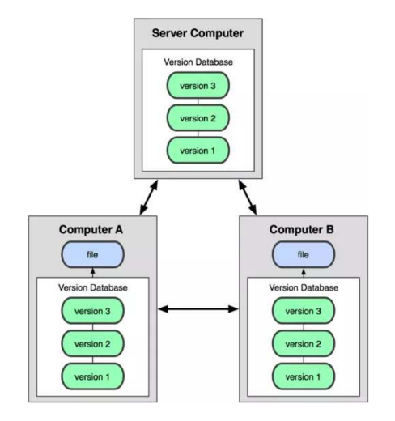
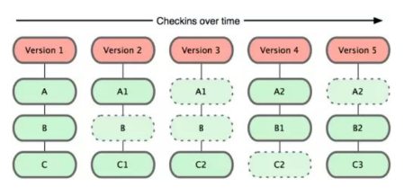
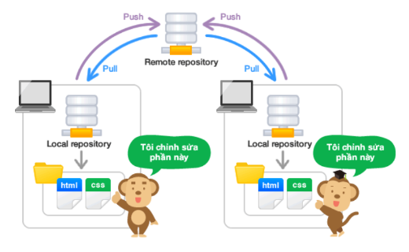
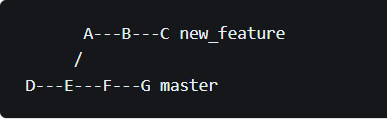
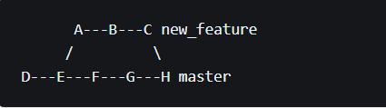

# **[JAVA] - Buổi 5 DEV THÌ KHÔNG CHỈ VIẾT CODE**

## **I.Version Control là gì và tại sao cần dùng nó?**

Version Control System (VCS) là một loại phần mềm giúp ta quản lý sự thay đổi trong source code của dự án theo thời gian một cách dễ dàng và thuận tiện.

VCS lưu trữ mọi sự thay đổi trong source code của dự án trong một cơ sở dữ liệu đặc biệt. Chúng ta có thể dễ dàng truy vấn ra được sự thay đổi của source code trong mộtt file tại một thời điểm bất kỳ. Và nếu cần chúng ta có thể dễ dàng đảo ngược source code trong file
trở về một thời điểm trước đó.

Hai thuật ngữ VCS (Version Control System) và SCM (Source code Management) được sử dụng thay thế cho nhau.

VCS đặc biệt hữu dụng trong các dự án lớn đòi hỏi sự tham gia của nhiều lập trình viên. Ví dụ tại cùng 1 thời điểm, chúng ta cần phát triển thêm nhiều feature (tính năng) mới cho phần mềm. Và mỗi thành viên trong team được phân công để phát triển một feature. Khi có hai thành viên cùng hoàn thành xong hai feature riêng biệt cùng lúc thì khi đó việc merge (gộp) code lại có thể sẽ gây ra conflict (xung đột) vì hai người này có thể sửa đổi cùng một đoạn code trên cùng một file.

Lúc này sử dụng VCS chúng ta có thể dễ dàng kiểm tra được sự thay đổi nào đến từ ai và cho feature nào.

**VCS Phân Tán và VCS Tập Trung**

Dựa theo cách thiết kế thì VCS được chia thành hai kiểu khác nhau đó là VCS tập trung (centralized) và VCS phân tán (distributed).

Với các VCS dạng tập trung thì source code của dự án sẽ được lưu trữ trên một kho tập trung (hay kho trung tâm) trên một máy chủ. Mỗi lập trình viên muốn tạo ra sự thay đổi cho source code lưu trữ trong kho trung tâm (centralized repository) thì họ cần phải thực hiện một công việc trước đó là update source code trên máy tính của họ với kho tập trung trước sau đó mới được thay đổi.

Ngược lại với VCS dạng phân tán thì mỗi lập trình viên sẽ có riêng một kho (repository) của mình và có thể tự do phát triển các feature và tạo version mới (hay đúng hơn là một commit) mà không cần phải đồng bộ với kho trên sever. Điều này sẽ giúp lập trình viên tập trung vào việc hoàn thành feature hay fix bug mà không cần lo về việc phải liên tục update code trên máy tính của họ với code trên sever để giảm xung đột. Việc xử lý xung đột (nếu có) sẽ được thực hiện một lần duy nhất.


## **II.Các khái niệm về Git**

**Git** chính là hệ thống quản lý phiên bản phân tán (DVCS), với các ưu điểm: tốc độ, đơn giản, phân tán, phù hợp với dự án lớn nhỏ.



**Git** Lưu trữ dữ liệu dưới dạng một loạt "ảnh chụp" (snapshot) của một tập hợp các file, có nghĩa là mỗi khi commit (lưu lại) thì Git tiến hành chụp lại hệ thống các file thời điểm đó và lưu giữ một tham chiếu đến ảnh chụp đó, nhớ rằng các file không có thay đổi gì Git sẽ không lưu lại filê đó lần nữa mà chỉ có một liên kết đến file đã lưu ở lần trước.



Repository hiểu đơn giản nó chính là cái kho lưu trữ tất cả những thông tin cần thiết để quản lý các sửa đổi và lịch sử của toàn bộ project. Repository của Git được chia thành hai loại lại remote repository và local repository.

### **1.Local Repository**

Local repository nằm trên chính máy tính của chúng ta, dành cho một người dùng. Repository này sẽ đồng bộ hóa với remote repository bằng các lệnh của git.

Tất cả các thay đổi đã được đánh dấu (commit) sẽ được lưu ở local repo cho đến khi chúng được đẩy (push) lên remote repo. Các thay đổi này chỉ tồn tại ở trên local của người dùng không visible với những người khác.

Tất cả các file ở Local Repo đều ở một trong hai trạng thái:

-   Untracked Files: Các file này dù có thay đổi / thêm / xóa thì git cũng không quan tâm. vì không nằm trong danh sách theo dõi của nó. Khi chúng ta sử dụng lệnh "git status" thì các file này sẽ có title là "Untracked files".

-   Tracked Files: Những files đã được thêm vào danh sách theo dõi của git được gọi là Tracked Files, những file này khi chúng ta thay đổi / thêm / xóa thì git sẽ nhận biết được điều đó và lưu các thay đổi này lại theo yêu cầu của chúng ta.

Trong các Tracked Files được git theo dõi lại có các trạng thái như sau:

-   Modified Files: Các file bị THAY ĐỔI. Khi chúng ta sử dụng lệnh "git status" thì các files bị thay đổi sẽ có title "Change not staged for commit".
-   Staged Files: Các file bị THAY ĐỔI đã được ĐÁNH DẤU để commit. Các files bị thay đổi sẽ có title "Changes to be commit" khi ta "git status".
-   Unmodified Files: Khi các file đã được ĐÁNH DẤU sau khi được COMMIT sẽ lại trở về trạng thái không thay đổi. (Do các thay đổi này sau khi được commit sẽ được lưu vào thư mục .git, và chúng ta có thể restore về trạng thái đó bất cứ lúc nào). Lúc này khi chúng ta "git status" sẽ không còn thấy các file này nữa.

### **2.Remote Repository**

Remote Repository là repository được cài đặt trên sever chuyên dụng. Ví dụ: GitHub, GitLab, Bitbucket,...

Do repository phân thành 2 loại lại local và remote nên với những công việc bình thường thì có thể sử dụng local repository và thực hiện trên toàn bộ máy sẵn có. Khi muốn công khai nội dung công việc mà bản thân đã làm trên local repository, thì sẽ upload lên remote repository rồi công khai. Thêm nữa, thông qua remote repository cũng có thể lấy về nội dung công việc của người khác.



### **3.Branch**

Branch hay còn gọi là nhánh, tương ứng với các phiên bản cụ thể trong kho lưu trữ tách ta từ project của chính bạn. Branch cho phép người dùng dễ dàng theo dõi các thay đổi thử nghiệm khi thực hiện với kho lưu trữ và có thể quay trở lại các phiên bản cũ hơn

Đây là thế mạnh của Git. Với Git, việc quản lý branch - nhánh rất dễ dàng. Mỗi nhánh trong Git gần giống như một workspace. Việc nhảy vào một nhánh để làm việc trong đó tương tự như việc chuyển workspace mới và cũng có thể quay lại workspace cũ một cách nhanh chóng

Branch được dùng để phát triển tính năng mới mà không làm ảnh hưởng đến code hiện tại



Như trong ví dụ, master là nhánh "mặc định" của repository. Khi thực hiện một tính năng mới để tránh ảnh hưởng đến code ở branch master, bạn tạo ra một nhánh mới là new_feature.



Khi thực hiện xong sẽ hợp nhất lại với nhánh master. Việc hợp nhất 2 nhánh lại được gọi là merge. Lúc này, ở tại điểm H trên nhánh master code của new_feature đã được cập nhất.

### **4.Commit**

Committed: tức là Git đã snapshot lại file ở Staging Area với 1 unique index trong Git directory.

Hành động chuyển sang trạng thái committed là commit. Hay commit là hành động record lại thay đổi trong repository của bạn.

Khi commit, trong repository sẽ tạo ra commit đã ghi lại sự khác biệt các file từ trạng thái đã commit lần trước với trạng thái hiện tại.

Mỗi commit đều có yêu cầu phải có commit message, để giải thích commit này là bạn đã làm gì trong này.

Các commit này có dạng 40 ký tự alphabet.

Để check trạng thái các file đã sẵn sàng commit chưa dùng lệnh

```Git
    $ git status
```

Để thực hiện commit, trước tiên mình sẽ đổi trạng thái file sang staged bằng cách add file đó hoặc add tất cả các file untracked/modified bằng câu lệnh

```git

    $ git add -A

```

Sau đó sử dụng câu lệnh commit

```git

$ git commit -m "commit message"

```
Để thấy commit mà chúng ta đã commit chúng ta sử dụng

```git

    $ git log

```

### **5.Merge**

Merge là quá trình kết hợp các thay đổi từ một nhánh (branch) vào nhánh khác. Quá trình này thường được sử dụng khi bạn muốn kết hợp các thay đổi từ một nhánh phụ (thường là một nhánh đang phát triển tính năng mới hoặc sửa đổi) vào nhánh chính (thường là nhánh master hoặc main).

Để merge các thay đổi tử một nhánh (branch) vào nhánh khác trong Git:
-   Checkout vào nhánh đích: Đầu tiên cần đảm bảo rằng bạn đang ở nhánh mà bạn muốn kết hợp thay đổi vào. Ví dụ, nếu muốn merge các thay đổi từ nhánh 'feature' vào 'master', hãy chắc chắn rằng bạn đang ở 'master'.
```git

    git checkout master

```
-   Merge: Sử dụng lệnh 'git merge' để kết hợp các thay đổi từ nhánh nguồn vào nhánh đích. Trong ví dụ này, 'feature' là nhánh bạn muốn merge vào 'master'.
-   Giải quyết xung đột (nếu có): Nếu có xung đột xảy ra trong quá trình merge, Git sẽ thông báo cho bạn biết về các tập tin có xung đột. Bạn cần phải mở các tập tin này, giải quyết xung đột bằng cách chỉnh sửa các tập tin để loại bỏ xung đột, sau đó thêm tập tin đã sửa đổi và tiếp túc quá trình merge.
-   Commit (nếu cần): Sau khi bạn đã giải quyết xung đột (nếu có), bạn cần commit các thay đổi đã merge vào nhánh đích.
-   Push (nếu cần): Nếu bạn đã merge vào nhánh chính trên remote repo, hãy đảm bảo rằng bạn push các thay đổi lên remote repo để cập nhật repository chi sẻ.

### **6.Pull**

Pull là một lệnh được sử dụng để cập nhật repository của bạn từ một remote repo và cập nhật nhánh hiện tại của bạn với các thay đổi mới nhất từ remote repo đó.

Lệnh 'git pull' kết hợp hai bước 'git fetch' và 'git merge'.

-   git fetch: Lấy toàn bộ thông tin từ remote repo, bao gồm các nhánh và commit mới nhất,nhưng không thực hiện bất kỳ thay đổi nào trên working directory hoặc local repo của bạn.
-   git merge (hoặc rebase): sau khi đã lấy thông tiên mới nhất từ remote repo bằng 'git fetch', 'git pull' tiếp tục bằng việc merge (hoặc rebase nếu bạn thiết lập mặc định) các thay đổi từ remote repo vào nhánh hiện tại mà bạn đang làm việc.

### **7.Push**

Push là hành động đưa nội dung của local repo lên remote repo. Push là cách bạn chuyển giao các commit từ local repo lên remote repo.

Cấu trúc

```git

    $ git push remote_name branch_name

```

### **8.Clone**

Clone là hành động thực hiện tải một bản sao có sẵn của một remote repo sever nào đó (có thể là dự án bạn tham gia). Đây là điểm khác biệt của Git so với một số hệ thống quản lý phiên bản mã nguồn khác vì clone là tạo ra một bản sao của gần như tất cả những gì của repository mà máy chủ đang lưu trữ. Bạn sẽ có được tất cả lịch sử đã xảy ra trên repository và hoàn toàn có thể quay lại, Undo lại bất kỳ thời điểm commit nào.

```git

    $ git clone ten_sever:duong_dan
vd  $ git clone git@github.com:hapo-nghialuu/tutorial.git
```

### **9.Fork**

Fork đề cập đề hành động sao chép một repository từ một nguồn (thường là repository công cộng của một người khác hoặc tổ chức) vào tài khoản cá nhân của bạn trên GitHub hoặc các dịch vụ hosting Git khác.

Khi bạn fork một respository, bạn tạo ra một bản sao của repository đó trong tài khoản GitHub của bạn. Bản sao này giữ nguyên lịch sử commit và cấu trúc thư mục từ repository gốc, nhưng nó hoàn toàn thuộc quyền kiểm soát của bạn và có thể sửa đổi mà không ảnh hưởng đến repository gốc

## **IV.Khi nào cần Pull Request? Cách tạo Pull request**

Pull request là một cơ chế trong git cho phép bạn đề xuất các thay đổi từ bản fork của một repository vào repository gốc. Cần pull request khi:

-   Đóng góp vào dự án chung: Bạn muốn đóng góp vào dự án mà không có quyền truy cập trực tiếp vào repository gốc. Bằng cách fork repository, thực hiện sử đổi trong bản fork của mình, sau đó tạo pull request, bạn có thể đề xuất các thay đổi của mình cho chủ sở hữu repository gốc.
-   Đánh giá và kiểm tra code: Trong môi trường làm việc cộng tác, pull request là một cách để các thành viên trong nhóm đánh giá và kiểm tra code trước khi được chấp nhận vào repository chính. Điều này giúp đảm bảo chất lượng code và tránh các lỗi không mong muốn.
-   Quản lý phiên bản và merge code an toàn: Pull request cung cấp một cơ chế để quản lý quá trình merge thay đổi. Trước khi thực hiện merge, chủ sở hữu repository có thể xem xét, bình luận và kiểm tra code đã đề xuất, đồng thời có thể giải quyết các xung đột hoặc sửa đổi cần thiết trước khi thêm thay đổi vào repository chính.
-   Theo dõi và bảo trì codebase: Pull request là một cách để theo dõi lịch sử các thay đổi và giữ cho code base được bảo trì, đồng thời tạo ra một lịch sử tõ ràng của các tính năng và sửa đổi.

**Cách tạo pull request**
-   Fork repository: Trước tiên, hãy fork repository mà bạn muốn đóng góp vào. Điều này sẽ tạp ra một bản sao của repository gốc trong tài khoản GitHub của bạn.
-   Clone repository đến máy tính local: Sử dụng lệnh 'git clone' để sao chép repository từ tài khoản GitHub của bạn đến máy tính local của bạn.

```git

    $ git clone <URL_repository_fork_cua_ban>

```
-   Tạo nhánh mới và thực hiện thay đổi: Di chuyển vào thư mục repository đã clone và tạo một nhánh mới để làm việc

```git

    $ git checkout -b ten_nhanh_moi

```

thực hiện các thay đổi, bổ sung tính năng mới hoặc sửa lỗi trong nhánh mới nay.

-   Commit và push thay đổi lên repository của bạn: Commit các thay đổi đã thực hiện và push chúng lên repository fork của bạn trên GitHub.

```git

    $ git add .
    $ git commit -m "commit message"
    $ push origin ten_nhanh_moi

```

-   Tạo pull request trên GitHub: Trên trang repository fork của bạn trên GitHub, chuyển sang tab "Pull requests" và chọn "New pull request".
-   Chọn branch và repository: Chọn branch mà bạn vừa push thay đổi từ dropdown. Đảm bảo rằng branch bạn đề xuất pull request từ repository fork của bạn đến repository gốc.
-   So sánh và tạo pull request: GitHub sẽ hiển thị sự so sánh giữa các thay đổi trong branch của bạn và branch trong repository gốc. Xác nhận rằng các thay đổi là chính xác. Điền thông tin cần thiết và bấm "Create pull request" để tạo pull request.
-   Mô tả và gửi pull request: Viết mô tả chi tiết về các thay đổi bạn đề xuất trong pull request và nhấn nút "Create pull request" để gửi yêu cầu đó.

## **V.UML là gì? Lý do cần vẽ UML**

**UML là gì**

UML là:

-   Ngôn ngữ đồ họa tiêu chuẩn, sử dụng cho nhiều lĩnh vực kỹ thuật trong đó có công nghệ phần mềm

-   Ngôn ngữ ký hiệu sử dụng trong lập trình hướng đối tượng.

-   Biểu diễn, quy định cụ thể, xây dựng và tài liệu về hệ thống phần mềm.

Lí do cần vẽ UML:

- Hiểu rõ yêu cầu:
UML giúp biểu diễn yêu cầu của khách hàng và những chức năng cần thực hiện trong hệ thống.
Cung cấp một phương tiện để diễn đạt yêu cầu một cách rõ ràng và dễ hiểu.

- Thiết kế hệ thống:
UML hỗ trợ việc thiết kế hệ thống bằng cách mô tả các lớp, đối tượng, mối quan hệ, và các phần tử khác của hệ thống.
Cho phép nhóm phát triển hiểu cấu trúc và quan hệ giữa các thành phần của hệ thống.

- Tạo mã nguồn:
UML có thể được sử dụng để sinh mã nguồn tự động hoặc hướng dẫn quá trình lập trình, đặc biệt là trong việc tạo ra các lớp và mối quan hệ giữa chúng.

- Hiểu rõ quy trình làm việc:
UML hỗ trợ mô hình hóa quy trình làm việc thông qua các sơ đồ hoạt động và sơ đồ tuần tự, giúp hiểu rõ luồng công việc trong hệ thống.

- Tài liệu hóa:
UML tạo ra tài liệu chi tiết và rõ ràng, giúp các thành viên trong nhóm phát triển và bảo trì hệ thống.

- Giao tiếp:
UML cung cấp một ngôn ngữ chung để giao tiếp giữa các thành viên trong nhóm phát triển, giúp họ hiểu rõ ý tưởng và thiết kế của nhau.

## **VI.Mô hình Class Diagram, Activity Diagram**

### **Mô hình Diagram**

Mô hình Diagram là một loại biểu đồ trong UML (Unified Modeling Language) được sử dụng để mô tả cấu trúc của một hệ thống phần mềm bằng cách chỉ ra các lớp, các thuộc tính của chúng, các phương thức và mối quan hệ giữa chúng.

```

-------------------------------------
|            Customer              |
-------------------------------------
| - customerID: int                |
| - name: string                   |
| - email: string                  |
-------------------------------------
| + makePurchase(): void           |
| + updateProfile(): void          |
-------------------------------------


```

Một số mối quan hệ thường thấy trong Class Diagram:
-   **Mối quan hệ kế thừa (Inheritance)**: Được biểu diễn bằng một mũi tên có đỉnh mũi tên hướng từ lớp con đến lớp cha.
-   **Mối quan hệ liên kết (Association)**: Biểu thị mối quan hệ giữa các đối tượng của các lớp khác nhau.
-   **Mối quan hệ gói (Aggregation và Composition)**: Biểu thị mối quan hệ giữa một lớp và các phần tử thành phần của nó. Trong trường hợp Aggregation, phần tử thành phần có thể tồn tại mà không cần lớp chứa. Trong khi Composition, phần tử thành phần tồn tại chỉ trong phạm vi của lớp chứa và sẽ bị hủy khi lớp chứa bị hủy.  

Class Diagram giúp cho việc hiểu cấu trúc của hệ thống, mối quan hệ giữa các đối tượng và cung cấp một cách trực quan để thảo luận về thiết kế phần mềm. Nó là một trong những công cụ quan trọng trong quá trình phát triển phần mềm và thiết kế hệ thống.

### **Mô hình Activity Diagram**

Mô hình Activity Diagram là một loại biểu đồ trong UML (Unified Modeling Language) được sử dụng để mô tả các hoạt động, luồng làm việc, hoặc quy trình trong một hệ thống hoặc quy trình kinh doanh. Nó giúp hiểu rõ các bước cần thực hiện và cách chúng tương tác với nhau trong quá trình hoạt động.

Trong mô hình Activity Diagram, các yếu tố chính bao gồm:

- **Activity (Hoạt động)**: Biểu thị một hành động cụ thể trong quy trình. Được biểu diễn bằng hình oval với tên của hoạt động trong đó.

- **Decision (Quyết định)**: Được biểu diễn bằng một hình romboid hoặc hình vuông có một điều kiện hoặc một tập hợp các điều kiện. Nó biểu thị một điểm trong quy trình khi quyết định cần được thực hiện để chọn một trong các nhánh khác nhau của quy trình.

- **Initial State (Trạng thái ban đầu) và Final State (Trạng thái cuối cùng)**: Được biểu diễn bằng hình tròn rỗng để chỉ trạng thái ban đầu và hình tròn đậm để chỉ trạng thái cuối cùng của quy trình.

- **Transition (Chuyển tiếp)**: Biểu diễn bằng mũi tên, cho thấy các quá trình chuyển đổi từ một hoạt động/sự kiện sang hoạt động/sự kiện khác.

- **Fork và Join (Phân nhánh và Gộp nhất)**: Fork biểu thị nhiều luồng hoạt động có thể diễn ra đồng thời. Join là nơi các luồng được kết hợp lại.

Activity Diagram giúp người phát triển và người tham gia hiểu rõ hơn về các hoạt động, chuỗi hoạt động, điều kiện quyết định, và luồng làm việc trong hệ thống hoặc quy trình kinh doanh. Nó hữu ích trong việc mô tả các quy trình phức tạp, tối ưu hóa quy trình làm việc và tương tác giữa các thành phần khác nhau của hệ thống.


